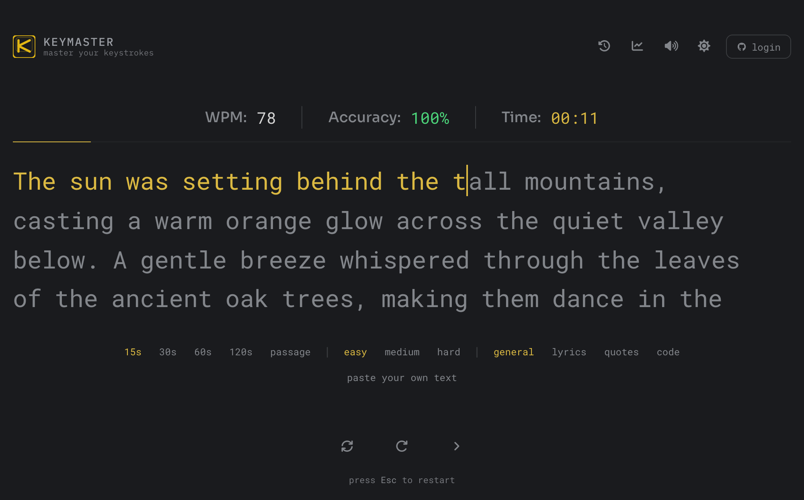
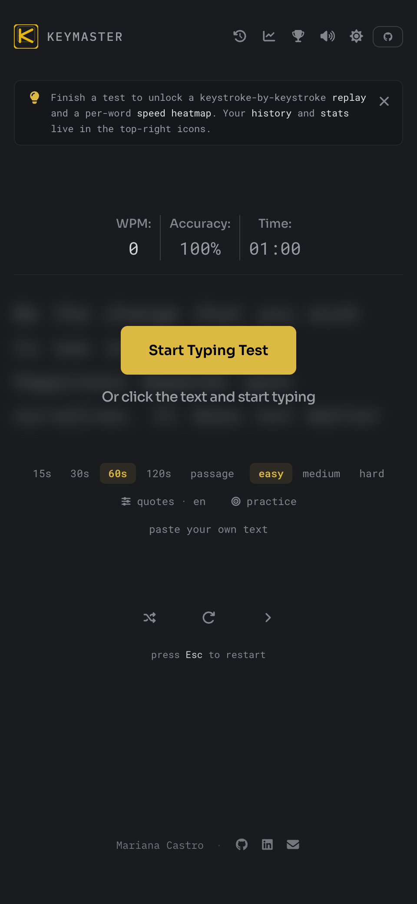
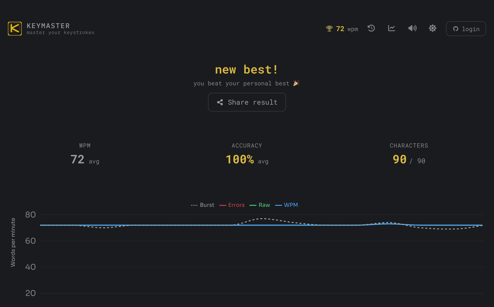

# Keymaster

A full-stack typing speed test with real-time metrics, session replay, per-word and per-key heatmaps, weak-key practice drills, a daily challenge, global and daily leaderboards, shareable public profiles, and persistent history — built with Next.js, Prisma, and PostgreSQL.

**[Live demo →](https://keymaster.marianacastro.dev/)**

---

## Highlights

**Typing engine built from scratch** — the core engine runs as a pure reducer (`engineReducer.ts`), making every state transition testable in isolation. No third-party typing library.

**Session replay** — after each test, you can replay your typing session and watch exactly where you slowed down or made mistakes, keystroke by keystroke.

**Per-word heatmap** — words are colored by relative speed, so you can immediately see which ones cost you the most time. Uses a bucket-based scoring system (`heatmap/logic/buckets.ts`) to normalize across sessions.

**WPM smoothing** — the real-time WPM chart applies a smoothing algorithm (`smoothData.ts`) to avoid noisy spikes, giving a cleaner picture of your actual pacing.

**Persistent history with personal bests** — sign in once and every result is saved. Your all-time best WPM is shown in the header, and your best run is highlighted in the history view.

**Global leaderboard** — all-time and weekly rankings by best WPM, with rank tiers. Your own position is pinned even when you fall outside the visible top entries.

**Daily challenge** — everyone in the world types the same passage each day, picked deterministically from the UTC date (no cron, no stored "text of the day"), with its own daily leaderboard. Built as an isolated typing surface that reuses the core engine, so it can't affect the main test.

**Public profiles** — every signed-in typist gets a shareable, server-rendered profile at `/u/[id]` with lifetime stats, all-time rank, a WPM-over-time trend, and mode/difficulty breakdowns. Leaderboard rows link straight to them.

**Key analysis & weak-key practice** — every keystroke feeds a per-key profile rendered as a color-coded keyboard heatmap, surfacing your weakest keys. The app can then generate targeted practice drills built from exactly those keys.

---

## Features

- **Real-time metrics** — WPM and accuracy tracked live as you type
- **Multiple modes** — Timed (15s, 30s, 60s, 120s) and Passage mode
- **Categories** — General, Lyrics, Quotes, and Code texts
- **Difficulty levels** — texts filtered by difficulty per category
- **Multilingual texts** — English, Portuguese, Spanish, French, and German
- **Global leaderboard** — all-time and weekly rankings by best WPM, with rank tiers
- **Daily challenge** — one shared, deterministic text per day with its own daily leaderboard
- **Public profiles** — shareable, server-rendered profile pages (`/u/[id]`) with lifetime stats and rank
- **Weak-key practice** — auto-generated drills targeting your worst keys
- **Key analysis** — per-key accuracy and speed rendered as a keyboard heatmap
- **Statistics dashboard** — aggregate stats, WPM-over-time trend, and breakdowns by mode & difficulty
- **Session replay & per-word heatmap** — review each run keystroke by keystroke
- **Custom text** — paste any text and practice typing it
- **Shareable results** — export a result card image or share via the native share sheet
- **User authentication** — OAuth sign-in via NextAuth, synced across devices
- **Sound feedback** — customizable keystroke sounds with volume control
- **Light / Dark theme** — fully themed UI with smooth transitions
- **Installable PWA** — service worker + web manifest for an app-like, offline-ready install
- **Accessible by default** — skip link, live regions, visible focus rings, and reduced-motion support

---

## Tech Stack

| Layer | Tech |
|---|---|
| Framework | Next.js 16 (Pages Router) |
| Language | TypeScript |
| Styling | Tailwind CSS v4 + custom UI components |
| Database | PostgreSQL via Prisma ORM |
| Auth | NextAuth.js |
| Charts | Recharts |
| Testing | Vitest (unit + integration) |
| Deploy | Vercel |

---

## 🖼️ Screenshots

<table>
  <tr>
    <td align="center" width="62%"><strong>Desktop</strong></td>
    <td align="center" width="38%"><strong>Mobile</strong></td>
  </tr>
  <tr>
    <td valign="top"></td>
    <td rowspan="2" valign="top"></td>
  </tr>
  <tr>
    <td valign="top"></td>
  </tr>
</table>

## Testing

The typing engine has extensive test coverage across multiple layers:

```
features/typing/
├── hooks/engineReducer.test.ts        # Reducer unit tests
├── logic/typing.test.ts               # Core logic unit tests
├── tests/integration/mechanics.test.ts  # Engine integration tests
├── tests/integration/sessions.test.ts   # Session flow tests
├── tests/results/basic-input.test.ts    # Results: basic scenarios
├── tests/results/corrections.test.ts    # Results: backspace handling
├── tests/results/errors-skips.test.ts   # Results: error and skip edge cases
└── tests/utils/session-validity.test.ts # Session validation
```

```bash
npm run test
```

---

## Project Structure

```
src/
├── features/
│   ├── typing/        # Engine reducer, hooks, word display, all tests
│   ├── results/       # Chart, stats, per-word heatmap, replay, key analysis
│   ├── daily/         # Daily challenge: deterministic text-of-day, arena, board
│   ├── profile/       # Public profile data assembly (server)
│   ├── stats/         # Shared stat tiles, breakdown table, WPM trend chart
│   ├── leaderboard/   # Ranking logic (tiers) and data hook
│   ├── settings/      # Config context, settings panel
│   └── sound/         # Audio context and playback
├── components/ui/     # Reusable UI primitives (button, pills, tooltip)
├── hooks/             # Shared hooks (useLocalStorage)
├── lib/               # Auth config, Prisma client, helpers
├── pages/             # Routes: home, /daily, /stats, /leaderboard, /u/[id] (SSR)
├── pages/api/
│   ├── auth/          # NextAuth handler
│   ├── rounds/        # REST endpoints for round history
│   ├── leaderboard/   # Ranked best-WPM entries (all-time & weekly)
│   ├── daily/         # Submit & rank the day's shared challenge
│   └── texts/         # Random text by category / difficulty / language
├── services/          # API client (roundsApi)
├── utils/             # Pure functions: calculateStats, consistency, buildChartData
└── types/             # Shared TypeScript types
```

---

## Running Locally

**Prerequisites:** Node.js 18+, a PostgreSQL database

```bash
git clone https://github.com/maricastroc/keymaster.git
cd keymaster
npm install
```

Create a `.env` file:

```env
DATABASE_URL="postgresql://..."
SHADOW_DATABASE_URL="postgresql://..."
NEXTAUTH_SECRET="your-secret"
NEXTAUTH_URL="http://localhost:3000"
```

```bash
npx prisma migrate dev
npx prisma db seed
npm run dev
```

Open [http://localhost:3000](http://localhost:3000).
